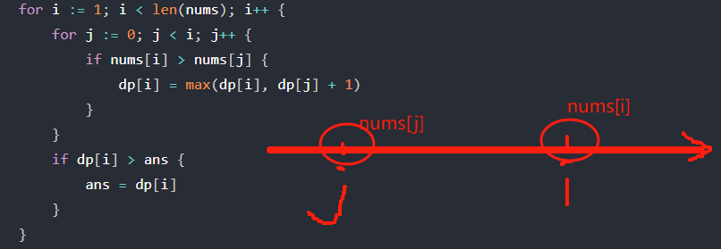
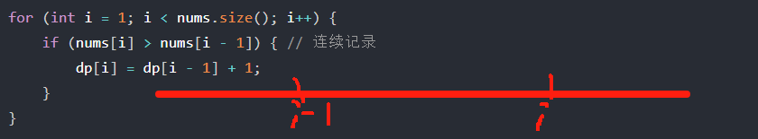
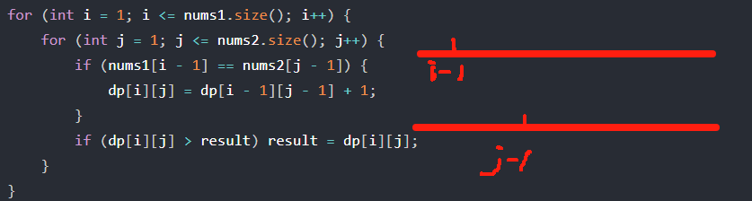
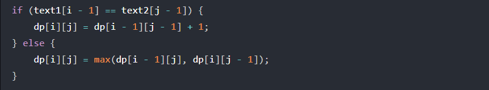
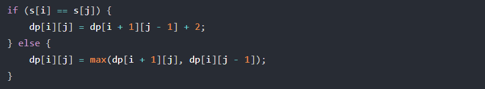
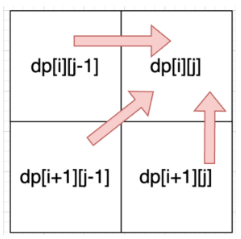

## 最长递增子序列
dp[i]表示  以nums[i]结尾的最长递增子序列的长度

dp[i] = max(dp[i], dp[j] + 1);

## 最长连续递增序列
dp[i]表示   以下标i为结尾的连续递增的子序列长度为dp[i]
因为本题要求【连续递增子序列】，所以就只要比较nums[i]与nums[i - 1]，而不用去比较nums[j]与nums[i]
既然不用j了，那么也不用两层for循环，
本题一层for循环就行，比较nums[i] 和 nums[i - 1]。

## 最长重复子数组
dp[i][j]表示   以下标 i - 1 为结尾的A，和以下标 j - 1 为结尾的B，最长重复子数组长度为dp[i][j] 
（特别注意： “以下标 i - 1 为结尾的A” 标明一定是 以A[i-1]为结尾的字符串 ）

## 最长公共子序列
区别上面的最长重复子数组，这里不要求是连续的了，但要有相对顺序
dp[i][j] 长度为[0, i - 1]的字符串text1与长度为[0, j - 1]的字符串text2的最长公共子序列为dp[i][j]
注意这里不是以 i-1结尾了，因为当 i-1 和j-1字符不一样时， 是可以满足递推公式的dp[i][j]=max(dp[i-1][j],dp[i][j-1])

## 最长回文子串

(回文问题都需要特别注意遍历顺序)

## 最长回文子序列
dp[i][j]：字符串s在[i, j]范围内最长的回文子序列的长度为dp[i][j]

遍历顺序从图里看

