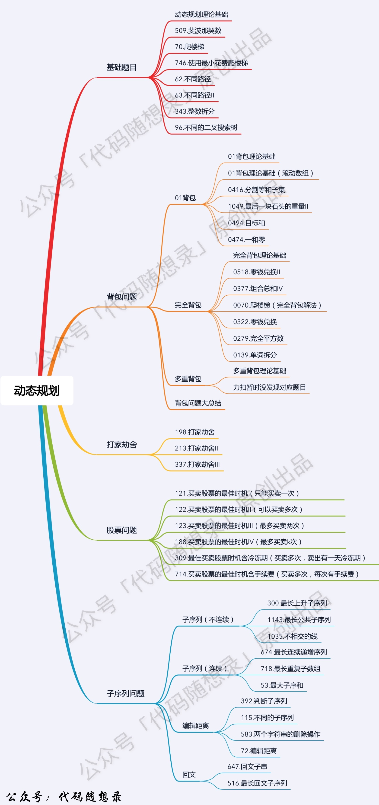

基础问题
背包问题
打家劫舍
股票问题
子序列问题

## 背包问题

### 0-1背包

dp[i][j] = max(dp[i - 1][j], dp[i - 1][j - weight[i]] + value[i]);
先背包还是先物品都可以

dp[j]=max(dp[j],dp[j-w[i]]+v[i])
遍历顺序必须是先物品再背包
遍历物品是从小到大
遍历背包的时候，是从大到小 【为了保证物品i只会被放入一次

### 完全背包
dp[i][j] = max(dp[i - 1][j], dp[i][j - weight[i]] + value[i]);
先背包还是先物品都可以

dp[j]=max(dp[j],dp[j-w[i]]+v[i])
背包需要正序遍历，来保证物品可以使用无限次

如果求组合数就是外层for循环遍历物品，内层for遍历背包。
组合：外物内包 wwnb

如果求排列数就是外层for遍历背包，内层for循环遍历物品。
排列数: 外包内物 wbnw

组合和排序的背包遍历都是从小到大

