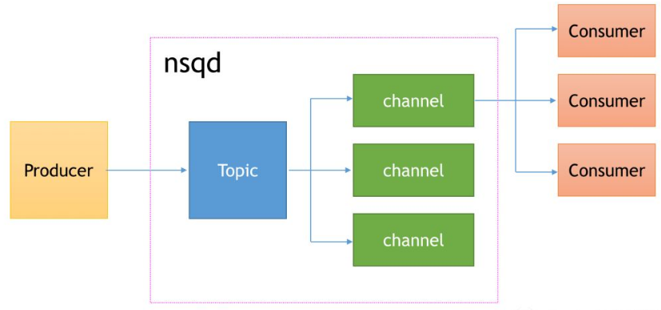

NSQ 是一个消息队列

构成的组件有：

> 1、nsqd：接受、排队、传递消息的守护进程，消息队列中的核心。
>
> 2、nsqlookupd：<u>因为会有好多个nsqd节点</u>，所以需要管理拓扑信息，其实就是围绕 nsqd节点 的发现服务，其存储了 nsqd 节点的注册信息，所以通过它就可以查询到指定 topic 主题的 nsqd 节点。
>
> 3、nsqadmin：一套封装好的 WEB UI ，可以看到各种统计数据并进行管理操作。
>
> 4、utilities：封装好的一些简单的工具（实际开发中用的不多）。

对于每个nsqd节点：

生产者关注的是 topic

关注的是消息投递到哪个 topic

每个topic可能有多个channel，topic一旦接收到消息就会广播到这些channel里

每个channel又会有多个consumer， channel会以负载均衡的方式选一个consumer传递消息

> 默认情况下消息不会被持久化到磁盘，只有当超出内存限制时才会将部分消息写入磁盘，但只要设置 –mem-queue-size=0 就可以将所有消息都持久化到磁盘。

一些特点：

* NSQ 保证消息至少被传递一次，但也有可能极端情况下会被传递多次，消费者需要额外注意这一点

* NSQ里的消息是无需的
* 官方建议把nsq和消息生产者部署在一起
* nsqlookupd 并非一定要使用，但在集群模式下建议使用，官方建议每个数据中心部署至少三个 nsqlookupd 就可以应对成百上千的集群节点（每个nsqlookupd 中间是相互独立的，保证其高可用）
* nsq 没有复杂的路由
* nsq 没有 replication 副本备份。即消息不会自动在多个节点之间进行复制备份。这意味着如果某个节点 down 掉，该节点上的消息可能会丢失
* nsqd 的数量决定整个集群的吞吐能力，最少不要少于 3 个 nsqd 节点
* nsqd的defer可以实现延时队列 的效果
* mpub可以一次发多条消息
* -max-msg-size : 单条消息的大小上限，默认 1048576 byte 即 1 M
* -mem-queue-size：队列在内存中保留的消息数量，默认 10000 。一旦消息数量超过了这个阈值，那么超出的消息将被写入到磁盘中

nsq 的集群没有replication，没有节点数据同步机制，不像其他高级队列一样有同步数据维护副本的概念，所以 nsq 的副本需要我们在代码层面维护实现

如何同步？ 又如何保证消息数据一致性？？
那就是每个实例都创建同名的topic，消息同时向这两个topic发送

http://nsqio.cn/nsqlookupd.html